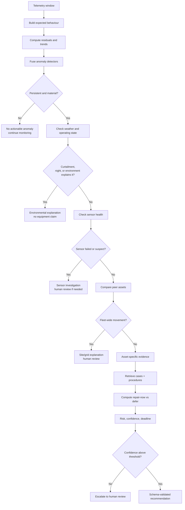

# Renewable Asset Intelligence

**Evidence-backed predictive maintenance for wind turbines and solar inverters.**

Renewable Asset Intelligence (RAI) turns telemetry into a defensible maintenance
decision. It learns what an asset should be doing, measures the conditioned deviation,
checks weather/curtailment/sensor and peer explanations, retrieves comparable cases,
quantifies the cost of waiting, and returns a confidence-gated recommendation for a
human operator.

> **Implementation status:** the simulator, Parquet/DuckDB stores, feature and model
> layers, economics, historical case retrieval, deterministic agent fallback, evaluation
> scripts, tests, and Next.js scaffold are implemented. The FastAPI route layer and
> browser-to-API integration are still in progress. This README does not present the
> scaffold as a finished production dashboard.

[](https://github.com/Krishna-Modi12/renewable-asset-intelligence/actions/workflows/quality.yml)
[](pyproject.toml)
[](web/package.json)

## Contents

- [Why RAI](#why-rai)
- [Key features](#key-features)
- [Tech stack](#tech-stack)
- [Architecture](#architecture)
- [Decision flow](#decision-flow)
- [Quick start](#quick-start)
- [Run the demonstrations](#run-the-demonstrations)
- [Evaluation and evidence](#evaluation-and-evidence)
- [Repository layout](#repository-layout)
- [Configuration](#configuration)
- [Testing and CI](#testing-and-ci)
- [API and frontend status](#api-and-frontend-status)
- [Limitations and non-claims](#limitations-and-non-claims)
- [Documentation](#documentation)
- [Contributing and license](#contributing-and-license)

## Why RAI

Low renewable output is ambiguous. It may be caused by equipment degradation, weather,
curtailment, a fleet-wide event, soiling, or a bad sensor. A raw power alarm cannot
reliably distinguish those causes, and an unexplained alert creates either unnecessary
truck rolls or alert fatigue.

RAI is designed around one operational question:

> **Is this asset behaving abnormally for the conditions it is operating in, and what
> should an operator do next?**

The system is deliberately not an autonomous controller:

- Python computes residuals, anomaly scores, risk, energy loss, and money.
- The agent receives only compact, computed evidence—not raw telemetry.
- Environmental and peer explanations are checked before an equipment fault is asserted.
- Low confidence escalates to human review.
- Physical control commands are outside the tool boundary.

## Key features

| Capability | What it provides | Implementation |
|---|---|---|
| Physics-grounded simulation | Wind and solar telemetry with twelve injected scenarios and exact ground truth | `rai/sim/` |
| Expected behaviour | Healthy-prefix, time-ordered models for asset-specific expectations | `rai/models/expected.py` |
| Residual-based detection | Residual z-scores, Isolation Forest, change-point detection, and persistence | `rai/models/anomaly.py` |
| Attribution gates | Weather, operating state, curtailment, sensor health, and peer comparison | `rai/models/environment.py`, `rai/models/peers.py` |
| Risk and economics | Risk bands, named drivers, intervention options, and avoidable exposure in INR | `rai/models/risk.py`, `rai/economics/` |
| Historical evidence | Similar trajectory retrieval from a case library | `rai/memory/` |
| Maintenance evidence | Cited retrieval from the project-authored knowledge corpus | `rai/rag/`, `knowledge/` |
| Safe reasoning | Deterministic fallback plus optional local Needle 2 runtime | `rai/agent/` |
| Reproducibility | Data generation, training, demo, evaluation, and checkpoint scripts | `scripts/` |

## Tech stack

| Area | Technology |
|---|---|
| Language | Python 3.11+ |
| Numerical/data | NumPy, pandas, SciPy, PyArrow |
| Storage | Parquet files queried with DuckDB; SQLite FTS5 for document retrieval |
| Models | scikit-learn, XGBoost, pvlib, ruptures |
| Contracts | Pydantic v2 |
| Optional local agent | `cactus-needle` / Needle 2 |
| API boundary | FastAPI and Uvicorn dependencies; routes are in progress |
| Frontend | Next.js 16.3.5, React 19, TypeScript, Tailwind CSS |
| Quality | pytest, Ruff, GitHub Actions |

No database server is required for the local data path. The repository does not contain
a Docker or cloud deployment configuration yet.

## Architecture

RAI is a layered pipeline. Each layer has one job and passes a typed object to the next.
The most important boundary is `EvidencePacket`: it is the only object allowed into the
agent layer.

```mermaid
flowchart LR
    subgraph Sources["1. Sources"]
        SIM["Physics simulator<br/>wind + solar"]
        EXT["External adapters<br/>(planned validation)"]
    end

    subgraph Numerical["2. Numerical evidence pipeline"]
        STORE["Parquet + DuckDB<br/>windowed reads"]
        FEATURES["Quality + operating state<br/>UTC, sensor checks"]
        EXPECTED["Expected healthy behaviour<br/>physics + XGBoost"]
        RESIDUALS["Residual construction<br/>actual - expected"]
        DETECT["Anomaly fusion<br/>z-score + IF + change point"]
        ATTR["Attribution gates<br/>environment + peers"]
        RISK["Risk assessment"]
    end

    PACKET["EvidencePacket<br/>compact computed evidence"]

    subgraph Decision["3. Decision support"]
        MEMORY["Historical cases"]
        KNOWLEDGE["Cited knowledge"]
        ECON["Python economics"]
        AGENT["Needle 2 or<br/>deterministic fallback"]
    end

    VERDICT["AgentVerdict<br/>recommend or escalate"]
    HUMAN["Human maintenance decision"]

    SIM --> STORE
    EXT -.-> STORE
    STORE --> FEATURES --> EXPECTED --> RESIDUALS --> DETECT --> ATTR --> RISK --> PACKET
    PACKET --> MEMORY
    PACKET --> KNOWLEDGE
    PACKET --> ECON
    PACKET --> AGENT
    MEMORY --> AGENT
    KNOWLEDGE --> AGENT
    ECON --> AGENT
    AGENT --> VERDICT --> HUMAN

    classDef boundary fill:#fff3cd,stroke:#b58105,stroke-width:2px;
    class PACKET boundary;
```



### What crosses the evidence boundary

`rai/models/pipeline.py` assembles the packet. `rai/schemas.py` defines its contract and
`EvidencePacket.to_agent_dict()` deliberately reduces it to a small, lossy dictionary:
health, risk, anomaly/persistence, the four strongest residual signals, peer verdict,
environment verdict, sensor state, curtailment, and solar soiling when applicable.

The agent does **not** receive Parquet rows, long time series, or uncomputed arithmetic.
The full packet remains available to the UI/API layer for evidence display; only the
compact projection is passed to reasoning.

### Layer responsibilities

| Layer | Responsibility | Must not do |
|---|---|---|
| Source/store | Normalize telemetry and provide time windows | Hide missing data with fabricated values |
| Features/state | Quality checks and operating-state classification | Treat night, below-cut-in, or curtailment as faults |
| Expected behaviour | Predict healthy signals from operating conditions | Train on a window containing the injected fault |
| Residuals/detectors | Quantify deviations and persistence | Fire an alert from one noisy sample |
| Attribution | Test environment, curtailment, sensor, and peer explanations | Skip the attribution gate |
| Risk/economics | Compute risk and intervention exposure | Let the language model perform arithmetic |
| Agent | Select read-only tools, explain, recommend, or escalate | Issue plant-control commands or invent evidence |
| Human | Accept, defer, reject, or confirm a ticket | Be bypassed for a physical action |

The detailed, maintainable source diagrams are available in
[`docs/assets/architecture.mmd`](docs/assets/architecture.mmd),
[`docs/assets/decision-loop.mmd`](docs/assets/decision-loop.mmd),
[`docs/assets/demo-flow.mmd`](docs/assets/demo-flow.mmd), and
[`docs/assets/data-flow.mmd`](docs/assets/data-flow.mmd).

## Decision flow

The order of the investigation is part of the safety argument. The system should not
jump from “low output” directly to “replace the gearbox.”



The executable orchestration is `rai/agent/investigator.py`; the deterministic rule chain
is in `rai/agent/fallback.py`. The investigation timeline records telemetry, expected
behaviour, environment, peers, history, knowledge, economics, and decision stages.

## Quick start

### Prerequisites

- Python 3.11 or newer
- Node.js 20+ and npm for the `web/` workspace
- Git
- Windows PowerShell, macOS, or Linux
- Optional: network access and model storage for Needle 2

The commands below use Windows paths because that is the repository’s primary development
environment. On macOS/Linux, replace `.venv\Scripts\python.exe` with
`.venv/bin/python` and `Set-Location web` with `cd web`.

### 1. Clone and install Python dependencies

```powershell
git clone https://github.com/Krishna-Modi12/renewable-asset-intelligence.git
Set-Location renewable-asset-intelligence

py -3.11 -m venv .venv
.venv\Scripts\python.exe -m pip install --upgrade pip
.venv\Scripts\python.exe -m pip install -e ".[dev,domain]"
```

Add `,agent` to the extras if you want to install the optional Needle 2 package:

```powershell
.venv\Scripts\python.exe -m pip install -e ".[dev,domain,agent]"
```

### 2. Install the frontend workspace

```powershell
Set-Location web
npm ci
Set-Location ..
```

### 3. Generate the local synthetic dataset

```powershell
.venv\Scripts\python.exe scripts\generate_data.py
```

This creates ignored files under `data\synthetic\`: one Parquet file per asset, site
meteorology, and `events.parquet` containing the simulator ground truth. The default
configuration produces 42 assets over 45 days: 18 wind turbines at 10-minute cadence and
24 solar inverters at 15-minute cadence.

### 4. Train expected-behaviour models

```powershell
.venv\Scripts\python.exe scripts\train.py
```

Models and detector artifacts are written under ignored `artifacts\`. Training uses
healthy-prefix, chronological splits; it does not use `shuffle=True` for telemetry.

### 5. Run the deterministic investigation

```powershell
.venv\Scripts\python.exe scripts\demo.py --scenario gearbox_bearing_wear
```

The script prepares missing data/models automatically, then investigates the corresponding
asset without probing the optional Needle runtime. Use `--json` for the complete
`Investigation` contract:

```powershell
.venv\Scripts\python.exe scripts\demo.py --scenario gearbox_bearing_wear --json
```

Expected output includes an anomaly score, risk band, environment and peer verdicts,
diagnosis, confidence, human-review state, recommendation, model path, and investigation
timeline. Values are generated at runtime and should not be copied into documentation as
fixed claims.

## Run the demonstrations

The simulator contains six equipment scenarios and six non-equipment lookalikes:

| Category | Scenarios |
|---|---|
| Equipment | gearbox bearing wear, generator overheating, pitch misalignment, yaw misalignment, string outage, inverter derate |
| Non-equipment/lookalike | soiling accumulation, anemometer drift, sensor freeze, curtailment window, cloud transient, icing event |

Run representative cases:

```powershell
.venv\Scripts\python.exe scripts\demo.py --scenario gearbox_bearing_wear
.venv\Scripts\python.exe scripts\demo.py --scenario cloud_transient
.venv\Scripts\python.exe scripts\demo.py --scenario anemometer_drift
.venv\Scripts\python.exe scripts\demo.py --scenario soiling_accumulation
```

The full judge sequence is in [`docs/DEMO.md`](docs/DEMO.md). The deterministic path is
the reliable demonstration path because it does not depend on downloading model weights.
Needle 2 is an optional local explanation layer over the same evidence and verdict
contracts.

## Evaluation and evidence

Run the reproducible evaluator after generating data and models:

```powershell
.venv\Scripts\python.exe scripts\evaluate.py
```

The evaluator writes:

- `artifacts\evaluation\results.json` — machine-readable measured output
- `artifacts\evaluation\summary.md` — human-readable summary
- `artifacts\evaluation\metrics.csv` — tabular benchmark output when benchmark records exist

The evaluation design includes chronological holdout rules, simulator scenario agreement,
model metrics, and operational measurements. Every reported number must come from an
artifact produced by a real run. Synthetic scenario agreement is an internal consistency
demonstration, not real-world accuracy.

Read [`docs/EVALUATION.md`](docs/EVALUATION.md) for definitions and
[`docs/CLAIMS.md`](docs/CLAIMS.md) for the claim-to-evidence matrix. The dataset and
licensing status are in [`docs/DATASETS.md`](docs/DATASETS.md).

## Repository layout

```text
rai/
├── schemas.py          Pydantic contracts: EvidencePacket, AgentVerdict, events
├── config.py           settings, fleet registry, units, thresholds, economics
├── sim/                physics-grounded telemetry and fault injection
├── ingest/             real-dataset adapter boundary
├── store/              Parquet/DuckDB reads and event access
├── features/           quality filters, states, windows, residual preparation
├── models/             expected behaviour, anomaly, environment, peers, risk
├── memory/             historical trajectory case retrieval
├── rag/                document ingestion and SQLite FTS5 retrieval
├── economics/          expected-loss and intervention option calculations
└── agent/              investigation timeline, tools, Needle, deterministic fallback

services/api/           FastAPI package boundary; route implementation in progress
web/                    Next.js operator interface scaffold
scripts/                generate_data, train, evaluate, demo, checkpoint utilities
tests/                  physics, store, model, economics, memory, agent, contract tests
docs/                   architecture, API contract, evaluation, datasets, design, limits
knowledge/              clearly labelled project-authored sample maintenance corpus
data/                   ignored generated/raw/intermediate/processed data
artifacts/              ignored models, indexes, logs, and evaluation outputs
```

Dependency direction is intentionally one-way: schemas do not import project modules;
domain code does not import the API; the agent consumes providers and evidence contracts
instead of reading raw telemetry directly.

## Configuration

Configuration lives in `rai/config.py` and can be overridden with the `RAI_` environment
prefix through Pydantic Settings. There is no required `.env` file for the deterministic
demo.

| Setting | Default | Purpose |
|---|---:|---|
| `RAI_SIM_SEED` | `20260912` | Reproducible simulator seed |
| `RAI_SIM_DAYS` | `45` | Generated history length |
| `RAI_WIND_INTERVAL_MIN` | `10` | Wind cadence |
| `RAI_SOLAR_INTERVAL_MIN` | `15` | Solar cadence |
| `RAI_RESIDUAL_Z_ALERT` | `3.0` | Residual alert threshold |
| `RAI_ANOMALY_SCORE_ALERT` | `0.60` | Fused anomaly threshold |
| `RAI_MIN_PERSISTENCE_HOURS` | `6.0` | Minimum persistence gate |
| `RAI_NEEDLE_CONFIDENCE_THRESHOLD` | `0.80` | Human-review threshold |
| `RAI_AGENT_MAX_TOOLS_PER_TURN` | `5` | Agent tool budget |
| `RAI_AGENT_TIMEOUT_S` | `30.0` | Optional agent timeout |
| `RAI_API_HOST` | `127.0.0.1` | Intended API bind host |
| `RAI_API_PORT` | `8000` | Intended API port |

Units are part of the contract: timestamps are UTC and timezone-aware, money is INR,
energy is kWh, power is kW, temperature is °C, and asset IDs use `WT-###`, `INV-###`,
or `STR-###` conventions.

## Testing and CI

Run the same checks used by GitHub Actions:

```powershell
.venv\Scripts\python.exe scripts\generate_data.py
.venv\Scripts\python.exe -m pytest tests\ -q
.venv\Scripts\ruff.exe check .

Set-Location web
npm ci
npm run lint
npm run build
Set-Location ..
```

The CI workflow is [`.github/workflows/quality.yml`](.github/workflows/quality.yml). It
generates ignored synthetic fixtures before Python tests, then runs the Python and
frontend jobs independently. The frontend is currently build-verified but not connected
to the FastAPI contract.

## API and frontend status

[`docs/API_CONTRACT.md`](docs/API_CONTRACT.md) is the frozen REST contract for the
intended service, including health, fleet, asset, timeseries, investigation, knowledge,
and ticket shapes. `services/api/` is the package boundary, but the route implementation
is not complete yet.

`web/` is a Next.js App Router scaffold. It can be linted and production-built, but it
does not yet provide a truthful end-to-end browser demo because it is not wired to the
FastAPI routes. Do not describe the current repository as a deployed dashboard.

## Limitations and non-claims

- Synthetic telemetry demonstrates internal consistency and controlled discrimination,
  not transfer to live SCADA or field accuracy.
- Public datasets are documented as validation targets unless an artifact records a
  completed local evaluation.
- Rule-based confidence is evidence agreement, not a calibrated probability.
- Economic outputs depend on configured tariff, downtime, capacity, and component-cost
  assumptions.
- Optional Needle availability depends on local model assets and network access.
- The knowledge corpus contains project-authored sample manuals, SOPs, and incidents; it
  is not OEM documentation.
- The API and frontend integration are incomplete.
- The system recommends and escalates; it does not control plant equipment.

See [`docs/LIMITATIONS.md`](docs/LIMITATIONS.md) and
[`docs/CLAIMS.md`](docs/CLAIMS.md) before presenting results.

## Documentation

| Document | Purpose |
|---|---|
| [`docs/ARCHITECTURE.md`](docs/ARCHITECTURE.md) | Detailed layer boundaries and design rationale |
| [`docs/API_CONTRACT.md`](docs/API_CONTRACT.md) | Frozen API shapes |
| [`docs/DEMO.md`](docs/DEMO.md) | Judge-facing demonstration sequence |
| [`docs/ML.md`](docs/ML.md) | Implemented numerical and decision layers |
| [`docs/EVALUATION.md`](docs/EVALUATION.md) | Split policy, metrics, and limitations |
| [`docs/DATASETS.md`](docs/DATASETS.md) | Dataset provenance and adapter plan |
| [`docs/DESIGN.md`](docs/DESIGN.md) | Operator interface design rules |
| [`docs/CLAIMS.md`](docs/CLAIMS.md) | Claims mapped to evidence |
| [`docs/REFERENCES.md`](docs/REFERENCES.md) | Research, datasets, standards, and software references |
| [`CHECKPOINT.md`](CHECKPOINT.md) | Consolidated implementation checkpoint |

## Contributing and license

Read [`CONTRIBUTING.md`](CONTRIBUTING.md), [`SECURITY.md`](SECURITY.md), and
[`CODE_OF_CONDUCT.md`](CODE_OF_CONDUCT.md) before contributing. The repository currently
has no recorded license decision; see [`docs/LICENSING.md`](docs/LICENSING.md) and do not
assume a license that is not present in the repository.
