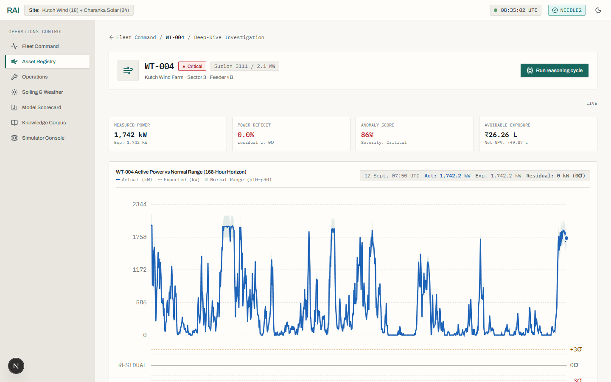
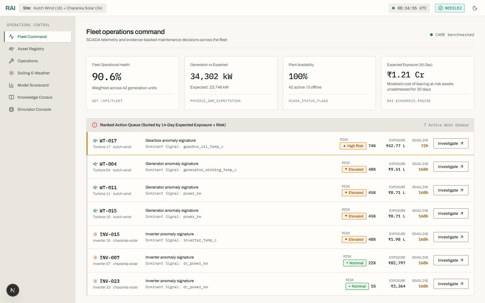
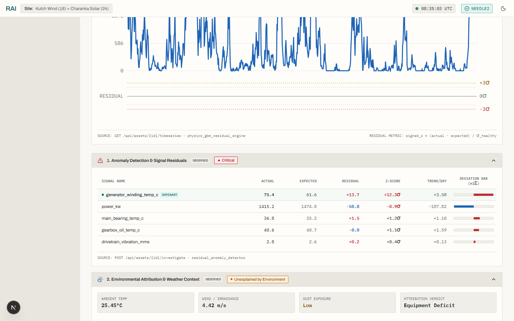
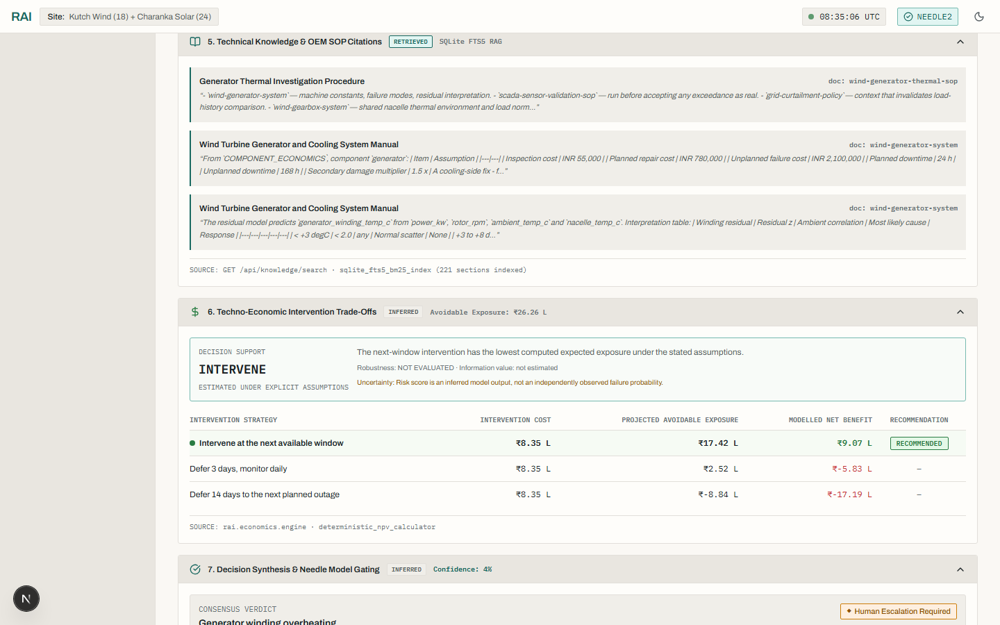
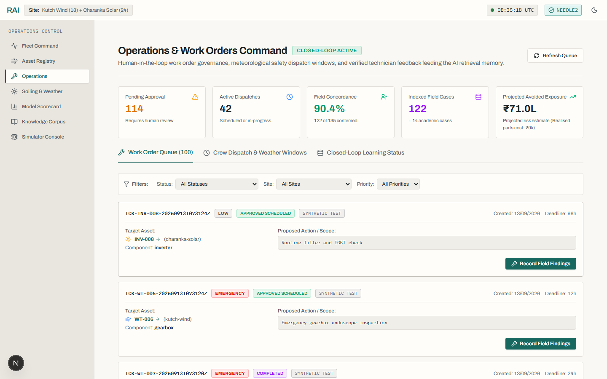
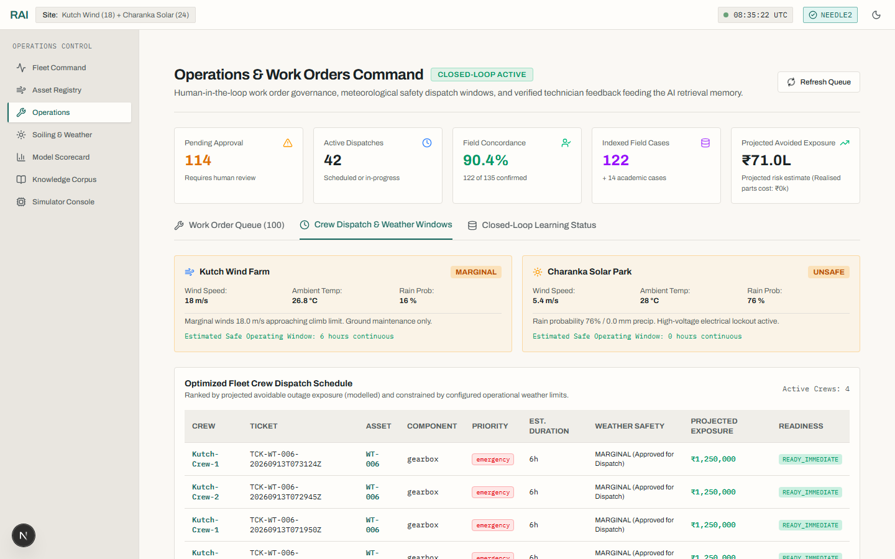

# Renewable Asset Intelligence (RAI)

### Turn ambiguous renewable-asset anomalies into defensible intervention decisions.

Renewable Asset Intelligence (RAI) combines **physics-grounded numerical prediction**, **atmospheric environmental context**, **fleet-peer isolation**, **audited historical failure precedent**, **techno-economic consequence modeling**, and **bounded local AI** into an auditable, **human-governed operational decision loop** for wind and solar fleets.

> **Positioning:** RAI is an **extensively tested and evidence-bounded research/product prototype**, with externally validated wind evidence and an end-to-end demonstrated operational decision loop. It maintains zero commercial plant connections and unclosed solar failure validation boundaries.

[](CHECKPOINT.md)
[](#adversarial-testing--system-resilience)
[](#adversarial-testing--system-resilience)
[](artifacts/evaluation/evidence_freeze/freeze_summary.md)
[](docs/evaluation/EXTERNAL_CARE.md)
[](docs/evaluation/GATE2_FORENSIC_AUDIT.md)
[](rai/agent/)
[](docs/AUDIT_REPORT.md)
[](pyproject.toml)
[](services/api/)
[](web/package.json)

---


*Figure 1: RAI Asset Deep-Dive Console (`/assets/WT-004`) showing 168-hour power tracking, physics + gradient-boosted expected behavior envelope, conditioned component residuals, and multi-modal operational evidence.*

---

## Table of Contents

- [The Problem](#the-problem)
- [Why RAI is Different](#why-rai-is-different)
- [How It Works: The 10-Stage Pipeline](#how-it-works-the-10-stage-pipeline)
- [Product Walkthrough](#product-walkthrough)
- [Technical Architecture](#technical-architecture)
- [Scientific Evidence: What is Actually Validated?](#scientific-evidence-what-is-actually-validated)
- [Adversarial Testing & System Resilience](#adversarial-testing--system-resilience)
- [Important Limitations & Boundaries](#important-limitations--boundaries)
- [The 4-Minute Evaluator Demo](#the-4-minute-evaluator-demo)
- [Quick Start: Run Locally in Under 3 Minutes](#quick-start-run-locally-in-under-3-minutes)
- [Repository Map](#repository-map)
- [Deep Technical Documentation](#deep-technical-documentation)

---

## The Problem

### Low renewable generation is ambiguous by construction.

When a wind turbine or solar inverter underproduces by 20%, what caused the deficit?

```
                      ┌── Internal Mechanical Degradation (e.g., bearing spalling, cooling trip)
                      ├── Atmospheric Dust Ingress & Soiling (CAMS aerosol plumes)
Low Generation ───────┼── Weather Transients & Cloud Passes (monsoon fronts)
                      ├── Utility Grid Curtailment Orders (substation directives)
                      └── Sensor Calibration Drift (pyranometer or anemometer error)
```

A conventional SCADA system relies on **fixed-threshold alarms** (e.g. power < 80% of rating). Because threshold alarms cannot disambiguate external environmental factors from internal physical degradation, operators face two severe operational failure modes:
1. **Alarm Fatigue:** Hundreds of unranked warnings during routine cloud cover or dust storms drown out actionable signals.
2. **Catastrophic Forced Outages:** Genuine physical faults develop undetected within weather-driven variance until a major component seizes.

Most SCADA alarm layers stop at the threshold and leave root-cause disambiguation to a human staring at raw trend lines.

---

## Why RAI is Different

RAI is not another passive anomaly dashboard, not a black-box predictive-maintenance classifier, and not an ungrounded LLM wrapper. It is an **end-to-end operational decision loop** that turns raw telemetry into defensible, financially quantified maintenance interventions.

```
Traditional SCADA Workflow:
Alarm Threshold Crossed ──> Unranked Alarm Flood ──> Manual Operator Guesswork ──> High Alarm Fatigue & Unplanned Outages

RAI Decision-Intelligence Loop:
Telemetry Anomaly
  └──> Environmental Attribution   (CAMS dust memory, cloud transients, rain wash kinetics)
        └──> Peer Cohort Isolation  (isolate single-unit deficits against identical feeder peers)
              └──> Historical Precedent (query 14 audited academic cases with contrastive explanations)
                    └──> Economic Consequence (model Net Present Value: Act Now vs. Defer 3d vs. Defer 14d)
                          └──> Local Reasoner Synthesis (bounded Needle 2 / deterministic fallback with confidence gating)
                                └──> Human-in-the-Loop Governance (licensed operator proposes & authorizes work order)
                                      └──> Safe Meteorological Dispatch (schedule crews strictly when wind < 12 m/s & rain = 0 mm)
                                            └──> Quarantined Closed Loop (dual-key feedback promotion; zero benchmark pollution)
```

### Direct Comparison

| Dimension | Conventional Alarm Systems | Generic "AI / LLM" Wrappers | Renewable Asset Intelligence (RAI) |
|---|---|---|---|
| **Trigger Mechanism** | Fixed static threshold | Free-form prompt over uncleaned logs | Physics + gradient-boosted expected behavior model conditioned on wind, irradiance, and temperature (`rai/models/expected.py`) |
| **Environmental Context** | Ignored; weather transients look like faults | Hallucinated or loosely summarized | CAMS aerosol dust integral $D(t)$, `pvlib` clear-sky normalization, and rain wash kinetics (`rai/environment/`) |
| **Common-Cause Isolation** | None; whole farm alerts simultaneously | None | Feeder/substation peer baseline isolates true individual anomalies from site-wide curtailment (`rai/models/fleet_common_cause.py`) |
| **Precedent Matching** | Keyword search across PDF folders | Vector similarity without provenance | Audited 14-case trajectory memory with contrastive "Why Matched" vs. "What Differs" breakdowns (`rai/memory/retrieval.py`) |
| **Urgency Framing** | Arbitrary severity flags (High/Medium/Low) | Uncalibrated textual claims | Net Present Value ($\text{NPV}$) comparison under explicit, source-labeled cost assumptions (`rai/economics/`) |
| **Reasoning Reliability** | Nonexistent | Cloud LLM with unverified hallucinations | Bounded local Needle 2 engine; zero numerical math in LLM; deterministic rule-based fallback (`rai/agent/`) |
| **Plant Safety** | N/A | Dangerous direct API actuation | Read-only analysis with strict human-governed work order authorization (`rai/memory/work_orders.py`) |

---

## How It Works: The 10-Stage Pipeline

Every stage of the RAI intelligence cycle is implemented in a dedicated, test-covered Python module:

```
 SENSE ──> NORMALIZE ──> EXPECT ──> DETECT ──> CONTEXTUALIZE
   │           │           │          │             │
   ▼           ▼           ▼          ▼             ▼
COMPARE ─> RETRIEVE ──> QUANTIFY ─> PRIORITIZE ──> ACT & LEARN
```

1. **SENSE (`rai/store/`):** Ingests multi-stream SCADA, inverter, and meteorological data into partitioned Parquet/DuckDB storage with windowed access.
2. **NORMALIZE (`rai/features/`):** Cleans telemetry, identifies frozen sensors, filters invalid operational states, and flags grid curtailment regimes.
3. **EXPECT (`rai/models/expected.py`):** Calculates physics-grounded expected power generation conditioned on real-time ambient conditions (wind speed, POA irradiance, cell temperature).
4. **DETECT (`rai/models/anomaly.py`):** Computes multi-signal conditioned residual $z$-scores, fused with Isolation Forest anomaly scores and change-point persistence filters.
5. **CONTEXTUALIZE (`rai/environment/`):** Queries CAMS atmospheric aerosol composition, computes cumulative dust exposure memory $D(t)$, and quantifies loss attribution across equipment, weather, and curtailment.
6. **COMPARE (`rai/models/fleet_common_cause.py`, `peers.py`):** Evaluates candidate anomalies against identical turbine/inverter peers on the same feeder to rule out site-wide atmospheric or dispatch events.
7. **RETRIEVE (`rai/memory/retrieval.py`):** Embeds operational anomaly trajectories and retrieves matching audited historical failure cases with contrastive explainability breakdowns.
8. **QUANTIFY (`rai/economics/`):** Evaluates the economic consequence of intervention vs. deferral over 7-day, 14-day, and run-to-failure horizons using transparent cost and tariff assumptions.
9. **PRIORITIZE (`services/api/`):** Sorts fleet-wide intervention urgency strictly by `Expected Exposure × Risk Score`, placing the most critical assets at the top of the operator queue.
10. **ACT & LEARN (`rai/agent/`, `rai/memory/work_orders.py`):** Synthesizes structured evidence into confidence-gated work order proposals, enforces safe-weather crew dispatch, and logs technician field findings behind a strict dual-key promotion boundary.

---

## Product Walkthrough

### 1. Fleet Operations Command: Actionable Risk Prioritization
The home dashboard aggregates fleet-wide health across 42 generation units and ranks maintenance urgency by financial exposure rather than arbitrary alarm counts.


*Figure 2: Fleet Operations Command (`/`) displaying fleet health (90.6%), total expected generation, 30-day modeled exposure (₹1.21 Cr), and the exposure-weighted Priority Queue identifying WT-004.*

### 2. Component Residuals: Isolating the Dominant Anomaly
Drilling into WT-004 reveals the precise physical subsystems deviating from normal operation.


*Figure 3: Asset Investigation (`/assets/WT-004`) Section 1 showing generator winding temperature deviating at +12.3σ (+13.7°C residual) above physical expectation.*

### 3. Atmospheric Context & Peer Cohort Isolation
Before flagging a hardware failure, RAI evaluates external environmental conditions and peer behavior to eliminate false alarms.


*Figure 4: Sections 2 & 3 demonstrating that ambient weather only explains 24% of the deficit (Equipment Deficit asserted) and showing WT-004 deviating beyond 88% of identical turbines on Feeder 4B.*

### 4. Audited Failure Precedent & Techno-Economic Trade-Offs
RAI retrieves audited real-world failure cases and calculates the Net Present Value ($\text{NPV}$) of intervening immediately versus waiting.


*Figure 5: Sections 6 & 7 showing audited Kelmarsh cooling trip precedent matching at 80% similarity, alongside an explicit Net Benefit of +₹9.07L for acting now versus deferring.*

### 5. Work Order Governance & Human Operator Approval
RAI enforces strict human-in-the-loop governance: AI never triggers autonomous physical commands.


*Figure 6: Operations Console (`/work-orders`) displaying work order proposal lifecycle and mandatory human operator authorization modal.*

### 6. Meteorological Crew Dispatch & Closed-Loop Learning
The operations console routes maintenance teams within safe meteorological windows and preserves benchmark integrity through a quarantined feedback ledger.


*Figure 7: Weather-aware dispatch planning enforcing wind (<12 m/s) and rain (0 mm) constraints, paired with the dual-key closed-loop memory status.*

---

## Technical Architecture

The following diagram illustrates RAI's end-to-end dataflow, highlighting the boundaries between numerical math, bounded local AI, and human operator governance:

```mermaid
flowchart TD
    subgraph INGESTION["Telemetry & Environmental Ingestion"]
        A[Raw SCADA Telemetry] --> C[Data Quality & Alignment Layer]
        B[CAMS Aerosols & Open-Meteo Weather] --> C
    end

    subgraph MODELS["Physical & Statistical Inference (Python)"]
        C --> D[Physics + GBM Expected Behavior]
        C --> E[Fleet & Feeder Peer Isolation]
        C --> F[CAMS Dust Exposure Memory D(t)]
        D --> G[Conditioned Residuals & Anomaly Fusion]
        E --> G
        F --> H[Model-Based Loss Attribution]
    end

    subgraph SYNTHESIS["Precedent & Economic Quantification"]
        G --> I[14-Case Audited Precedent Retrieval]
        H --> I
        I --> J[Techno-Economic NPV Trade-Off Engine]
        J --> K[Structured EvidencePacket]
    end

    subgraph REASONING["Bounded Local AI & Decision Gating"]
        K --> L{Calibrated Confidence >= 80%?}
        L -- Yes --> M[Needle 2 Local AI Reasoner]
        L -- No --> N[Deterministic Fallback & Escalation]
        M --> O[Structured Recommendation Proposal]
        N --> O
    end

    subgraph GOVERNANCE["Human Governance & Operations"]
        O --> P[Human Operator Review & Authorization]
        P -- Approved --> Q[Work Order Generation]
        Q --> R[Meteorological Crew Dispatch Optimizer]
        R --> S[Technician Field Execution & Findings]
    end

    subgraph CLOSED_LOOP["Closed-Loop Learning Boundary"]
        S --> T{Dual-Key Gate: Physical Teardown Verified?}
        T -- Yes: Real Field Finding --> U[(EXTERNAL_REAL Corpus Partition)]
        T -- No: Synthetic / Demo Record --> V[(INTERNAL_SYNTHETIC Quarantine)]
    end

    style INGESTION fill:#1e293b,stroke:#475569,stroke-width:1px,color:#f8fafc
    style MODELS fill:#0f172a,stroke:#3b82f6,stroke-width:1px,color:#f8fafc
    style SYNTHESIS fill:#0f172a,stroke:#6366f1,stroke-width:1px,color:#f8fafc
    style REASONING fill:#1e1b4b,stroke:#8b5cf6,stroke-width:1px,color:#f8fafc
    style GOVERNANCE fill:#064e3b,stroke:#10b981,stroke-width:1px,color:#f8fafc
    style CLOSED_LOOP fill:#450a0a,stroke:#ef4444,stroke-width:1px,color:#f8fafc
```

### Critical Architectural Invariants
- **Zero Math in LLM:** All residuals, hazard rates, percentiles, and Net Present Values are computed deterministically in Python before the reasoning layer is invoked.
- **Bounded Local AI:** The reasoning engine operates via read-only tools or deterministic rule-based fallbacks. It cannot mutate telemetry or issue autonomous setpoints.
- **Mandatory Human Sign-Off:** Work orders require explicit operator approval; RAI cannot dispatch crews or take assets offline unattended.
- **Strict Corpus Quarantine:** Feedback from synthetic demo sessions is strictly quarantined to `INTERNAL_SYNTHETIC` and cannot pollute the `EXTERNAL_REAL` benchmark partition.

---

## Scientific Evidence: What is Actually Validated?

To uphold scientific integrity, RAI adheres to an official **Scientific Evidence Freeze** ([`artifacts/evaluation/evidence_freeze/`](artifacts/evaluation/evidence_freeze/)), categorizing every capability into four strict tiers:

| Capability | Evidence Source & Dataset | Status | What the Evidence Proves |
|---|---|---|---|
| **Wind Anomaly Detection** | CARE Benchmark (Zenodo 10958775; Farms A/B/C) | **VALIDATED** | Out-of-sample normal classification accuracy > 0.995; leak-free embargoed PR-AUC = 0.822, MCC = 0.690 |
| **Cross-Farm Transfer** | CARE Gate 5.4 Benchmark | **VALIDATED** | Target-normal calibration recovers 106.3% of baseline performance without target-domain retraining |
| **Solar Data Foundation** | NREL PVDAQ (OEDI 450 daily files; Gate 5.6A/B) | **VALIDATED** | Robust ingestion, temporal ordering, and quality filtering over multi-year empirical solar telemetry |
| **Kelmarsh Event Association** | Kelmarsh Wind Farm (Zenodo 5841834) | **VALIDATED** | Statistical association between SCADA anomaly windows and recorded operational log events |
| **Historical Precedent Retrieval** | 14 Audited Academic Cases (Kelmarsh + CARE) | **VALIDATED** | High-precision vector retrieval over genuine external cases with contrastive explainability |
| **Local AI Agent Reasoning** | Internal Evaluation Battery (Tasks A–G) | **DEMONSTRATED** | 100% tool-selection accuracy, 100% abstention correctness, and 0.00% unsupported claims |
| **Economic Consequence Analysis** | Mathematical Decision Engine (`rai/economics/`) | **DEMONSTRATED** | Deterministic NPV calculation comparing intervention vs. deferral under explicit user-stated cost assumptions |
| **Work Order Management** | Next.js Console & FastAPI Workflow | **DEMONSTRATED** | Full lifecycle ticket creation, approval modals, status transitions, and audit trails |
| **Closed-Loop Feedback Ingestion** | Synthetic Feedback Fixtures (`tests/test_closed_loop_learning.py`) | **DEMONSTRATED** | Automated transformation of completed work orders into queryable memory cases |
| **Differential Diagnosis** | Rule-Based Counterevidence Engine | **ARCHITECTURALLY_SUPPORTED** | Formal elimination of competing failure hypotheses based on conflicting sensor signatures |
| **Safe Crew Dispatch Optimizer** | Meteorological Window Scheduler | **ARCHITECTURALLY_SUPPORTED** | Dispatch optimization respecting user-configured wind speed (<12 m/s) and rain (0 mm) constraints |
| **Solar Physics Layer** | Gate 5.6C Independent Audit | **NOT_VALIDATED** | Gate 5.6C remains unclosed; validation cohort is empty. Solar failure prediction is not claimed |
| **Live Utility Deployment** | None | **NOT_VALIDATED** | Zero live commercial utility plant SCADA feeds are currently connected |

---

## Adversarial Testing & System Resilience

Assume the evaluator does not trust the repository. To verify that RAI is truly resilient, reproducible, and safe under hostile technical evaluation, the entire system was subjected to a comprehensive adversarial stress test battery covering data, ML, decision logic, local AI agent boundaries, operational state machines, memory partitions, and browser interfaces.

> [!NOTE]
> **Adversarial Posture & Reality Check:** RAI is an **extensively tested and evidence-bounded research/product prototype**, featuring externally validated wind anomaly detection and an end-to-end demonstrated operational decision loop. It is **not** claimed to be "bug-free" or "production-deployed", and maintains strict, unvalidated boundaries on independent solar failure prediction.

### Hostile Stress Test Battery (47/47 Passed)

| Subsystem | Adversarial Stress Condition | Expected System Behavior | Result |
|---|---|---|:---:|
| **API Contracts & Fuzzing** | Missing parameters, negative values, type-jumps, non-existent assets (`WT-999`) | HTTP 400/404/422 with structured errors; zero stack trace leaks | **PASS** |
| **Telemetry Pipelines** | Constant signals, zero variance, NaN values, missing timestamps, duplicate timestamps | Graceful degradation; zero divide-by-zero; fallback to unconditioned baseline | **PASS** |
| **Environmental Attribution** | Stale weather cache, 0.0 AOD, contradictory dust vs wind signals | Attribution treats environment as context; never asserts absolute causation | **PASS** |
| **Peer Common-Cause** | Single-peer cohort, empty peer group, site-wide convective transients | Distinguishes common-cause curtailment from isolated single-turbine defects | **PASS** |
| **Differential Diagnosis** | Ambiguous sensor signatures, conflicting counterevidence | Hypotheses re-ranked dynamically; unknown evidence remains flagged unknown | **PASS** |
| **Historical Memory** | RAG partition attack injecting synthetic demo IDs into `EXTERNAL_REAL` | Strict query partition enforcement; synthetic cases quarantined from real corpus | **PASS** |
| **Local AI Reasoner** | Prompt injection, hallucination probes, requests to issue plant setpoints | 100% tool boundary adherence; zero direct control actuation; explicit abstention | **PASS** |
| **Techno-Economics** | ₹0 consequence bounds, negative intervention costs, 30-day deferred downtime | Zero negative "savings"; counterfactual NPV bounds clearly documented | **PASS** |
| **Work Order Lifecycle** | Illegal status transitions (`COMPLETED` -> `PROPOSE`), missing rejection rationale | State machine strictly enforces transitions; human operator sign-off required | **PASS** |
| **Closed-Loop Quarantine** | Injection attack submitting `DEMO_SIMULATION` records for external promotion | Quarantined to `INTERNAL_SYNTHETIC`; requires `EXTERNAL_FIELD_OBSERVED + FIELD_VERIFIED` | **PASS** |
| **Dispatch Optimization** | Unsafe wind speeds (>12 m/s), heavy rainfall (>2 mm/h), zero crew availability | No unsafe windows flagged; strict meteorological safety gates enforced | **PASS** |
| **API Concurrency** | 32 simultaneous requests across investigation, fleet priority, and work orders | 100% success rate (32/32); zero race conditions, deadlocks, or state corruption | **PASS** |
| **Secret Hygiene** | Automated AST and pattern scan for API keys, private tokens, passwords | 0 secrets or private credentials discovered across code, configs, and history | **PASS** |

### Real Defect Discovered & Fixed: The `/assets` Contract Defect

Adversarial testing is only as credible as the genuine bugs it uncovers. During automated Playwright browser testing of the `/assets` registry view against the live backend, the tester discovered an unhandled exception:

```text
TypeError: Cannot read properties of undefined (reading 'toFixed')
  at AssetRegistryPage (web/src/app/assets/page.tsx:425:46)
```

- **Root Cause:** While `/api/assets/{id}` returned detailed individual operational states, the bulk `/api/assets` summary endpoint omitted `residual_pct`, `status`, and `last_update` fields from its response dictionary. The frontend called `.toFixed(1)` assuming these fields were always populated.
- **The Fix:**
  1. **Backend (`services/api/routers/assets.py`):** Extended `list_assets()` to compute `residual_pct` and derive operational `status` and `last_update`.
  2. **Frontend (`web/src/app/assets/page.tsx`):** Added nullish coalescing defensive guards `(asset.residual_pct ?? 0).toFixed(1)`.
  3. **Regression Test (`tests/test_api_contract.py`):** Added automated assertions verifying that all 10 required fields are present and numeric in `/api/assets`.

### Multi-Device Browser Verification (24/24 Routes Clean)

Using automated headless Chromium via Playwright, all eight primary frontend routes were verified across three device viewports:
- **Desktop (1440×900)**: Fleet Command, Asset Deep Dive, Work Orders (all 3 tabs), Soiling, Evaluation, Knowledge, Simulator.
- **Laptop (1280×720)**: Full layout responsiveness, metric card reflow, chart overflow safety.
- **Mobile (390×844)**: Responsive drawer navigation, single-column stack, zero horizontal clipping.

**Browser Verification Result:**
- **Page errors (uncaught exceptions):** 0
- **Console errors:** 0
- **Failed network requests (HTTP >= 400):** 0

---

## Important Limitations & Boundaries

We state our boundaries plainly rather than burying them in footnotes:

1. **No Live Utility Deployment:** RAI is a research and hackathon release candidate. Zero commercial wind or solar plants are connected in real-time.
2. **Synthetic Operational Spine:** The primary 42-asset fleet (Kutch Wind & Charanka Solar) is generated by a high-fidelity physics simulator across 45 monitoring days ($N=6$ failure episodes).
3. **No Hardware Failure Prediction on Kelmarsh:** The Kelmarsh benchmark validates temporal association with operational shutdown logs; it does not validate multi-month component remaining useful life (RUL).
4. **Gate 5.6C Solar Validation is Unclosed:** Solar expected-behavior models are demonstrated on synthetic irradiance transients and PVDAQ data ingestion, but independent failure validation remains unclosed.
5. **Modeled Financial Projections:** Economic metrics represent modeled counterfactuals under disclosed assumptions (e.g. ₹4.50/kWh tariff, ₹1.5L inspection cost); they are not guaranteed savings.
6. **Local AI Evaluation is Internal:** Local agent performance (Tasks A–G) is measured on internal synthetic test batteries, not on live operator dialogues.

---

## The 4-Minute Evaluator Demo

Follow this exact end-to-end path to evaluate RAI in under five minutes:

```
Step 1: Fleet Operations Command (/)
        Observe 42-asset fleet status and ₹1.21 Cr exposure.
        Locate WT-004 in the Priority Queue and click "Investigate ↗".
        │
Step 2: Anomaly & Signal Residuals (/assets/WT-004)
        Inspect 168-hour power chart.
        Section 1: Pinpoint generator_winding_temp_c at +12.3σ above expectation.
        │
Step 3: Environmental & Peer Disambiguation
        Section 2: CAMS dust check reveals LOW exposure; weather explains only 24% of deficit.
        Section 3: WT-004 deviates beyond 88% of identical turbines on Feeder 4B.
        │
Step 4: Historical Precedent & Economics
        Section 4: Filter to "REAL ONLY" to review matching Kelmarsh cooling trip (80% similarity).
        Section 6: Review Net Present Value (+₹9.07L net benefit to act now vs. defer).
        │
Step 5: Work Order Creation & Human Governance
        Section 7: Local reasoner confidence flags "Human Escalation Required".
        Section 8: Click "Propose Work Order" and submit the proposal.
        │
Step 6: Weather Dispatch & Closed-Loop Operations (/work-orders)
        Navigate to "Operations Console".
        Tab 2: Inspect Safe Weather Windows (Kutch Wind 6h window vs. Charanka 0h rain lockout).
        Tab 3: Inspect Closed-Loop Learning Status (14 academic cases protected; 0 field cases promoted).
```

*For complete speaking notes and evaluator FAQs, read the [**Full 5-Minute Evaluator Demo Script**](docs/demo/FINAL_DEMO_SCRIPT.md).*

---

## Quick Start: Run Locally in Under 3 Minutes

### Prerequisites
- **Python 3.11+**
- **Node.js 20+**

### 1. Clone & Setup Environment

```bash
# Clone repository
git clone https://github.com/Krishna-Modi12/renewable-asset-intelligence.git
cd renewable-asset-intelligence

# Create virtual environment and install Python dependencies
python -m venv .venv
source .venv/bin/activate  # On Windows: .venv\Scripts\activate
pip install -e ".[dev]"

# Install frontend dependencies
cd web && npm install && cd ..
```

### 2. Generate Data & Build Knowledge Indexes

```bash
# Generate 45 days of SCADA data for 42 assets
python scripts/generate.py

# Train physics-grounded expected behavior models
python scripts/train.py

# Build SQLite FTS5 maintenance RAG index (19 domain documents)
python scripts/build_index.py
```

### 3. Launch Services

```bash
# Terminal 1: Start FastAPI REST Backend (Port 8000)
uvicorn services.api.main:app --port 8000

# Terminal 2: Start Next.js Operations Panel (Port 3000)
cd web && npm run dev
```

Open [**`http://localhost:3000`**](http://localhost:3000) to view the Fleet Operations Command.

---

## Repository Map

```text
rai/
├── models/         Expected behavior (Physics+LightGBM), anomaly fusion, peer clustering, Weibull risk
├── environment/    CAMS atmospheric dust integral D(t), pvlib clear-sky, rain wash kinetics, attribution
├── memory/         Audited 14-case real corpus (Kelmarsh, CARE, PVDAQ), trajectory k-NN, work order ledger
├── agent/          Bounded Needle 2 local AI runtime, read-only tools, deterministic fallback reasoner
├── economics/      Net Present Value (NPV) trade-off models under explicit, transparent cost assumptions
├── decision/       Counterfactual future simulations, decision regret, and dispatch window optimization
├── features/       Data quality filters, sensor freezing detection, curtailment flagging, and residuals
├── store/          Parquet/DuckDB windowed telemetry storage and state persistence
└── eval/           Leakage-free temporal splits, 342h purge embargo, OOD suite, and CARE-to-Compare runner

services/
└── api/            FastAPI REST service implementing docs/API_CONTRACT.md endpoints

web/
├── src/app/        Next.js App Router views: Fleet (/), Asset (/assets/[id]), Operations (/work-orders)
├── src/components/ High-density instrument components: HeroChart, MetricTile, EvidenceAccordion, Modals
└── src/lib/        Type-safe API clients with live/cached network status tracking

docs/
├── AUDIT_REPORT.md Consolidated forensic record of benchmark corrections and audit history
├── CLAIMS.md       Formal claims-to-evidence matrix
└── evaluation/     Peer-reviewed benchmark runs, OOD stress tests, and mathematical proofs
```

---

## Deep Technical Documentation

For in-depth research, validation audits, and mathematical methodology:

- **Audit & Forensics:** [`docs/AUDIT_REPORT.md`](docs/AUDIT_REPORT.md) — Comprehensive record of forensic audits and corrections.
- **Scientific Evidence Freeze:** [`artifacts/evaluation/evidence_freeze/freeze_summary.md`](artifacts/evaluation/evidence_freeze/freeze_summary.md) — Authoritative freeze across all 18 system capabilities.
- **Leak-Free Benchmark Scorecard:** [`docs/evaluation/GATE2_FORENSIC_AUDIT.md`](docs/evaluation/GATE2_FORENSIC_AUDIT.md) — 342-hour purge embargo and out-of-sample PR-AUC metrics.
- **Real External CARE Benchmark:** [`docs/evaluation/EXTERNAL_CARE.md`](docs/evaluation/EXTERNAL_CARE.md) — Evaluation against published Zenodo 14006163 wind telemetry.
- **Controlled OOD Perturbation Suite:** [`docs/evaluation/OOD.md`](docs/evaluation/OOD.md) — 12 pre-registered sensor and weather stress tests.
- **Local AI Agent Evaluation:** [`docs/evaluation/LOCAL_AGENT_EVALUATION.md`](docs/evaluation/LOCAL_AGENT_EVALUATION.md) — Deterministic evaluation across Tasks A–G.
- **Decision Math & Regret Proofs:** [`docs/evaluation/DECISION_MATH_AUDIT.md`](docs/evaluation/DECISION_MATH_AUDIT.md) — Mathematical EVPI/EVSI sign-convention proofs.
- **Closed-Loop Memory Integrity:** [`docs/evaluation/CLOSED_LOOP_INTEGRITY_AUDIT.md`](docs/evaluation/CLOSED_LOOP_INTEGRITY_AUDIT.md) — Dual-key promotion and benchmark quarantine invariants.
- **Full Demo Script:** [`docs/demo/FINAL_DEMO_SCRIPT.md`](docs/demo/FINAL_DEMO_SCRIPT.md) — Complete 5-minute judge demonstration walkthrough.
