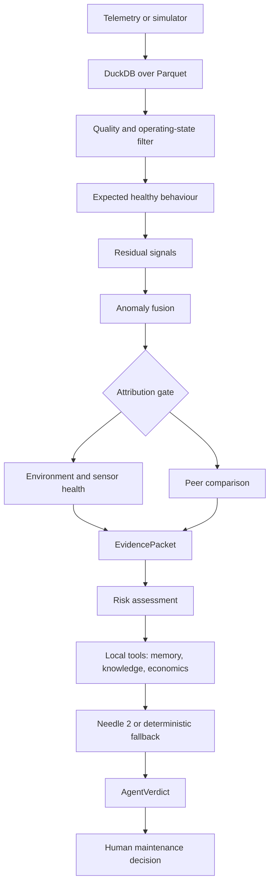

# Renewable Asset Intelligence

### Edge-native predictive maintenance for wind and solar assets

RAI turns renewable-farm telemetry into an evidence-backed maintenance decision. It
compares each asset with its expected healthy behaviour, checks whether weather or
fleet-wide conditions explain a deviation, retrieves similar failure trajectories,
quantifies the cost of waiting, and produces a structured recommendation for a human
operator.

> **Current status:** the numerical pipeline, simulator, stores, economics, historical
> memory, deterministic agent fallback, and 91-test suite are implemented. The FastAPI
> endpoint layer and the production operator interface are still in progress. Claims in
> this repository distinguish implemented code, generated synthetic demonstrations, and
> planned integration work.

[Quick start](#quick-start) · [Architecture](#architecture) ·
[Phase 2 evaluation](#phase-2-evaluation) · [Judge demo](docs/DEMO.md) ·
[Limitations](docs/LIMITATIONS.md)

## Why this exists

Renewable assets can lose energy and money before a visible failure occurs. A gearbox may
heat up slowly, an inverter may derate, or a solar block may accumulate soiling. A raw
power alarm cannot tell whether the cause is equipment, weather, curtailment, or a bad
sensor. Too many false alarms make an operations team ignore the useful ones.

RAI is designed around the operational question:

> **Is this asset behaving abnormally for the conditions it is operating in, and what
> should an operator do next?**

The output is not just an anomaly score. It is a traceable chain of residuals, detector
results, environmental attribution, peer comparison, historical cases, economic options,
and a confidence-gated recommendation.

## What we built

| Stage | What it does | Main code |
|---|---|---|
| Sense | Generates physics-grounded wind/solar telemetry and injected ground truth | `rai/sim/` |
| Normalize | Cleans values, classifies operating state, and keeps UTC timestamps | `rai/features/`, `rai/store/` |
| Compare | Learns expected healthy behaviour and constructs residuals | `rai/models/expected.py` |
| Diagnose | Fuses residual-z, Isolation Forest, and change-point evidence | `rai/models/anomaly.py` |
| Attribute | Separates weather, curtailment, sensor, fleet-wide, and asset-specific causes | `rai/models/environment.py`, `peers.py` |
| Predict | Produces a risk band and named risk drivers | `rai/models/risk.py` |
| Retrieve | Finds similar trajectories and local maintenance citations | `rai/memory/`, `knowledge/` |
| Quantify | Compares intervention options in INR using Python arithmetic | `rai/economics/` |
| Decide | Produces a schema-validated verdict or escalates to human review | `rai/agent/` |

## Core differentiator

RAI is not “an AI model that detects faults.” Its safety and usefulness come from the
combination of:

1. expected healthy behaviour conditioned on operating conditions;
2. multiple independent anomaly signals;
3. peer/fleet comparison;
4. mandatory environmental and sensor attribution;
5. risk estimation;
6. historical case memory and cited procedures;
7. explicit economics for acting now versus waiting;
8. a local agent that explains structured evidence rather than inventing numbers.

## Explain it like I’m new

Imagine a turbine’s output falls.

1. RAI asks what output was expected at the measured wind, temperature, and air density.
2. It measures the difference between expected and actual behaviour.
3. It checks whether neighbouring turbines fell at the same time.
4. It checks curtailment, operating state, weather, and sensor health.
5. If a persistent, asset-specific vibration and temperature pattern remains, it searches
   for similar cases.
6. It compares repair-now and defer options using the configured tariff and component
   cost assumptions.
7. The local reasoner recommends an action only when the evidence is strong enough;
   otherwise it explicitly requests human review.

## Architecture



The hard boundary is `EvidencePacket`: raw telemetry never enters the agent context.
`EvidencePacket.to_agent_dict()` keeps only compact, computed evidence. Python computes
residuals, risk, energy loss, and money; the agent selects tools and explains the result.

See [the detailed architecture](docs/ARCHITECTURE.md) and the frozen
[API contract](docs/API_CONTRACT.md).

## Machine learning and decision layers

| Component | Purpose | Status |
|---|---|---|
| Physics references | Interpretable wind power and solar behaviour baselines | Implemented |
| XGBoost expected-behaviour models | Predict healthy signals under current conditions | Implemented |
| Residual construction | Converts raw differences into comparable z-scores and trends | Implemented |
| Isolation Forest | Multivariate residual outlier signal | Implemented |
| Change-point detector | Detects step changes in conditioned behaviour | Implemented |
| Peer comparison | Distinguishes one asset from a shared fleet movement | Implemented |
| Environmental attribution | Handles weather, curtailment, and sensor health | Implemented |
| Risk model | Produces a risk score/band with calibration metadata when fitted | Implemented |
| Trajectory memory | Retrieves similar synthetic historical cases | Implemented |
| Local RAG index | Planned interface; curated knowledge corpus is present | Partial |
| Needle 2 | Optional local tool-calling explanation layer | Implemented with deterministic fallback |
| FastAPI + operator UI | Frozen contract and frontend scaffold exist | Integration in progress |

Detailed model notes are in [docs/ML.md](docs/ML.md).

## Supported assets and scenarios

The frozen registry contains wind-turbine and solar-inverter examples with asset IDs such
as `WT-017` and `INV-023`. The simulator writes twelve scenarios with explicit
`is_equipment_fault` ground truth:

- equipment: gearbox wear, generator overheating, pitch misalignment, yaw misalignment,
  string outage, inverter derate;
- non-equipment: soiling, anemometer drift, sensor freeze, curtailment, cloud transient,
  icing.

These are controlled demonstrations, not proof that the same performance transfers to
real plants. Dataset provenance and external-data status are documented in
[docs/DATASETS.md](docs/DATASETS.md).

## Quick start

### Requirements

- Python 3.11 or newer
- Node.js and npm for the `web/` workspace
- Windows PowerShell commands below use the checked-in `.venv`; adapt the path separator
  for another operating system
- No database server is required: telemetry is stored as Parquet and queried through
  in-process DuckDB
- Needle weights are optional; the deterministic reasoner keeps the demo runnable when
  the model download is unavailable

### Install

```powershell
py -3.11 -m venv .venv
.venv\Scripts\python.exe -m pip install -e ".[dev,domain,agent]"
Set-Location web
npm ci
Set-Location ..
```

If the environment already contains the repository `.venv`, install is not needed.

### Generate data and run the deterministic demo

```powershell
.venv\Scripts\python.exe scripts\generate_data.py
.venv\Scripts\python.exe scripts\train.py
.venv\Scripts\python.exe scripts\demo.py --scenario gearbox_bearing_wear
```

The simulator and model artifacts are intentionally ignored by Git. Re-run these commands
after cloning rather than committing generated Parquet or model binaries.

Useful judge scenarios:

```powershell
.venv\Scripts\python.exe scripts\demo.py --scenario gearbox_bearing_wear
.venv\Scripts\python.exe scripts\demo.py --scenario cloud_transient
.venv\Scripts\python.exe scripts\demo.py --scenario anemometer_drift
.venv\Scripts\python.exe scripts\demo.py --scenario soiling_accumulation
```

### Test and lint

```powershell
.venv\Scripts\python.exe -m pytest tests\ -q
.venv\Scripts\python.exe -m pytest tests\test_agent_reasoning.py -k gearbox -q
.venv\Scripts\ruff.exe check .
```

### Frontend

The Next.js workspace is currently a scaffold and is not yet wired to the FastAPI
contract. Its verified package commands are:

```powershell
Set-Location web
npm run dev
npm run lint
npm run build
```

## Phase 2 evaluation

The evaluation is deliberately separated into measured results and future claims.

**Currently implemented and demonstrable**

- deterministic physics-grounded simulator with explicit event ground truth;
- time-ordered healthy-prefix training for expected-behaviour models;
- physical plausibility and fault-presence tests;
- environmental discrimination rules;
- structured fallback investigations with economics and historical cases;
- reproducible evaluation output under `artifacts/evaluation/`.

**Run it**

```powershell
.venv\Scripts\python.exe scripts\evaluate.py
```

This writes `artifacts/evaluation/results.json` and `summary.md`. The report records
model metrics generated during the run and scenario-level agreement against simulator
flags. It does **not** claim real-world accuracy, calibrated failure probability, or
performance on an external dataset.

The split policy is chronological and healthy-prefix-only; telemetry is never randomly
shuffled. See [docs/EVALUATION.md](docs/EVALUATION.md) for metric definitions,
provenance, and limitations.

## Demo

The judge-facing sequence and expected observations are in
[docs/DEMO.md](docs/DEMO.md). The shortest deterministic path is:

```powershell
.venv\Scripts\python.exe scripts\demo.py --scenario gearbox_bearing_wear
```

It assembles evidence, applies environment and peer gates, retrieves cases, evaluates
economic options, and prints the structured recommendation. A live API-backed dashboard
is not claimed until `services/api/` and `web/` are integrated.

## Why local AI

Needle 2 is not the forecasting model and not the anomaly detector. It is an optional
local tool-calling layer over compact evidence. This keeps raw telemetry out of a cloud
LLM context and allows the system to degrade truthfully when weights are unavailable.
The deterministic reasoner follows the same `AgentVerdict` contract and labels itself
with `fallback_used=true`.

The agent cannot control plant equipment. Ticket creation is the only confirm-required
action in the intended tool model; all other tools are read-only.

## Data and provenance

The primary reproducibility spine is generated synthetic telemetry because each event has
known onset, detectability, end, and equipment/non-equipment labels. Public datasets and
future adapters are documented but are not silently represented as locally evaluated
results. Full datasets and generated binaries are excluded from Git by `.gitignore`.

- [Dataset guide](docs/DATASETS.md)
- [Evaluation output](artifacts/evaluation/summary.md) after running the evaluator
- [Knowledge corpus](knowledge/) — clearly labelled project-authored sample documents

## Repository map

```text
rai/                 domain package: schemas, simulator, models, stores, agent, economics
services/api/        FastAPI package boundary (endpoint implementation in progress)
web/                 Next.js App Router workspace (integration in progress)
scripts/             data generation, training, evaluation, demo, checkpoint tools
tests/               physics, store, economics, memory, agent, and contract tests
docs/                architecture, API contract, datasets, design, and evaluation guides
knowledge/           project-authored maintenance manuals, SOPs, and incident examples
data/                ignored generated/raw/intermediate/processed data
artifacts/           ignored model/index outputs plus generated evaluation reports
```

## Limitations and non-claims

- Synthetic data demonstrates internal consistency, not real-world deployment performance.
- External public datasets are documented as future validation sources unless a report
  explicitly records a local run.
- The fallback confidence is evidence agreement, not a calibrated probability.
- Economic outputs depend on configurable tariffs, capacity factors, downtime, and
  component-cost assumptions.
- Needle availability depends on its local model assets; its absence is expected to be
  visible rather than silently hidden.
- The API contract is frozen, but the FastAPI implementation and operator UI integration
  are not complete.
- The system recommends and escalates; it does not autonomously control equipment.

See [docs/LIMITATIONS.md](docs/LIMITATIONS.md) for the reviewer-oriented version.

## Development and project health

- [Contributing](CONTRIBUTING.md)
- [Security policy](SECURITY.md)
- [Code of conduct](CODE_OF_CONDUCT.md)
- [Copilot instructions](.github/copilot-instructions.md)
- [Current build checkpoint](CHECKPOINT.md)

There is currently no repository licensing decision recorded. See
[docs/LICENSING.md](docs/LICENSING.md); do not redistribute this code under an assumed
license until the project owner adds an explicit `LICENSE` file.

## Roadmap

**Completed:** contracts, fleet configuration, simulator, stores, expected-behaviour and
diagnostic layers, economics, case memory, fallback investigations, tests, and judge
scripts.

**Current:** implement the frozen FastAPI surface, build the evidence-ledger frontend,
index the local knowledge corpus, and add measured evaluation artifacts.

**Future:** validate transfer to real SCADA, expand solar and wind labels, improve
uncertainty calibration, add operational integrations, and test on edge hardware.
